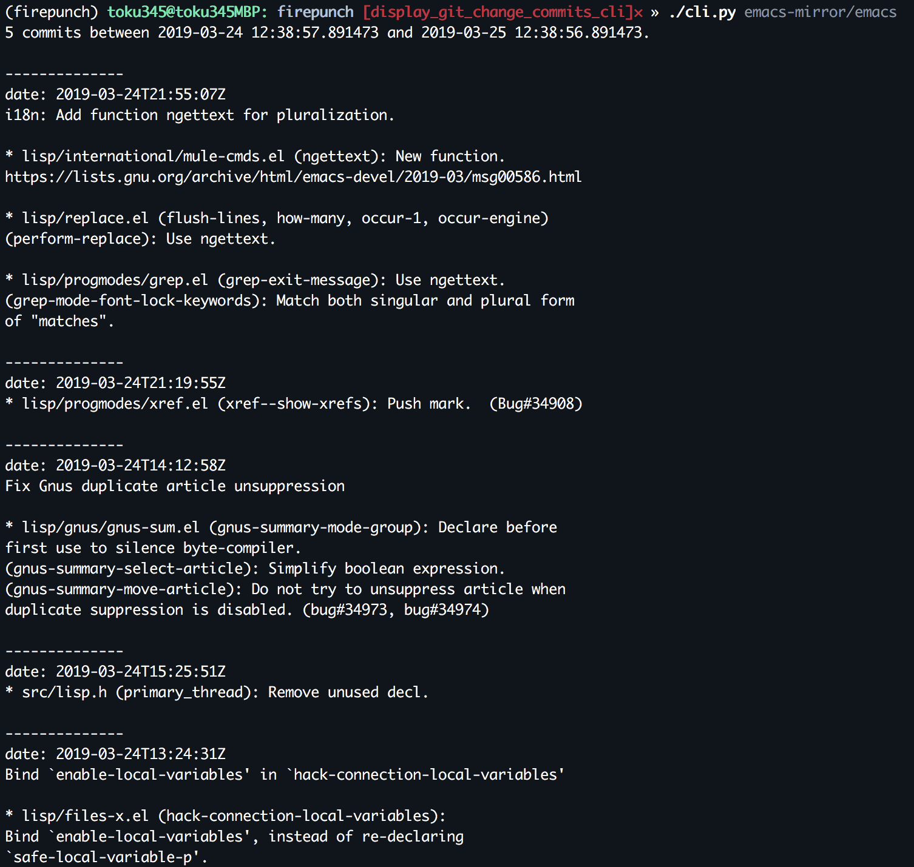

# FIREPUNCH 🔥👊🏻

[](https://travis-ci.com/toku345/firepunch)

## Description

Notify specific GitHub repos change of the day before on every morning!

## Requirement

- Python 3.7


## Installation

### cli

``` console
$ pipenv install --dev
$ pipenv shell

# if you use direnv
$ cp .envrc.sample .envrc
$ $EDITOR .envrc # set your GitHub access token
$ direnv allow

# or set `export GITHUB_ACCESS_TOKEN=XXXXXX` to your .bash_profile / .zshenv
```

### testing

``` console
$ pipenv run pytest
# or
$ pipenv shell
$ pytest
```

## Usage

### cli

``` console
$ ./cli.py <repo_name>

# e.g.
$ ./cli.py toku345/firepunch
```



## License

Apache License 2.0
